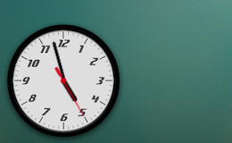

analog-clock-widget
===================

A simple [Übersicht](http://tracesof.net/uebersicht/) Widget. This will enable a classy simple themeable analog clock on your desktop to make it more sleek and useful.

Basic idea (and default theme) is ported and improved from a tutorial of [Toby Pitman](http://css-tricks.com/css3-clock/).
Other themes are extracted from various win7 clock gadgets. So those may not be used considering copyright.
Those are only for example purposes to show how to add and apply a new theme. You can always create/collect images to have your own dreamed theme live!

## Screenshot

## Download

To download just the zipped widget folder, check out [the latest release](https://github.com/ashikahmad/analog-clock-widget/releases/latest).

## Contributing

Have an idea for improving this widget? [Open an issue](https://github.com/ashikahmad/analog-clock-widget/issues/new) or fork this repository and send a pull request :grinning:.

If you want to contribute, having a go at one of these items above might be a good place to start! :+1:

## License

[CC0 1.0 Universal](./LICENSE)
